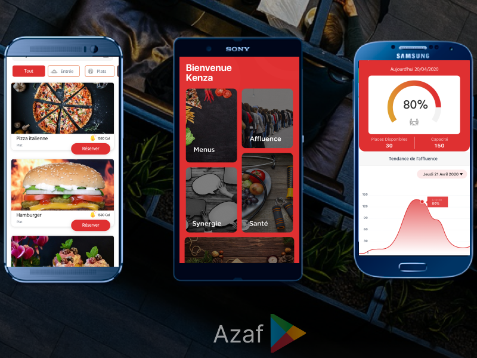

  
  
  
    
    

 

### A passionate Problem Solver, who chose Coding to help build impactful solutions through code.

 

<!--
**0ussamaBernou/0ussamaBernou** is a ✨ _special_ ✨ repository because its `README.md` (this file) appears on your GitHub profile.
Here are some ideas to get you started:

- 🔭 I’m currently working on ...
- 🌱 I’m currently learning ...
- 👯 I’m looking to collaborate on ...
- 🤔 I’m looking for help with ...
- 💬 Ask me about ...
- 📫 How to reach me: ...
- 😄 Pronouns: ...
- ⚡ Fun fact: ...
  -->
  
- 🔭 I’m currently working on myself

 

 

<h3 align="left">:hammer_and_wrench: Languages and Tools:</h3>

  
 <a href="https://www.w3schools.com/css/" target="_blank" rel="noreferrer"> 

&nbsp;
&nbsp;
&nbsp;
  </a>        
  &nbsp;
&nbsp;
&nbsp;
&nbsp;
&nbsp;
&nbsp;

 

## Projects

<table>
      <tr>
        <td width="50%">
          <h3 align="center">Azaf</h3>
          

             
		
		
            

		app available in <a href="https://play.google.com/store/apps/details?id=com.azaf.icoz" target="_blank" ref="noreferrer">Play Store</a>
            

          

        </td>
	<td width="50%">
          <h3 align="center">Ayat</h3>
          

            
		
		
            

		app available in <a href="https://github.com/ET-TOUNANI/ayat" target="_blank" ref="noreferrer">link</a>
            

          

        </td>
    </tr>
    <tr>
	<td width="50%">
          <h3 align="center">Fylo - Landing Page</h3>
          

          <!--
           
		  
		
            

             A software Product Landing Page
            

          

          -->
        </td>
	<td width="50%">
          <h3 align="center">Source - Template</h3>
          

          <!--
           
		   
		
            

             A multi-purpose landing page template
            

          

          -->
        </td>
        </tr>
</table>

 
 

 

[Ÿ HŸPE]: https://yhype.me
[GitHub Profile Views Counter]: https://github.com/ET-TOUNANI/github-profile-views-counter

<!--
### [My CodeWar Profile](https://www.codewars.com/users/0ussamaBernou)
(https://git.io/streak-stats)
-->

 

##
  <em><b>I love connecting with different people</b> so if you want to say <b>hi, I'll be happy to meet you more!</b> :)</em>

  ##
  

