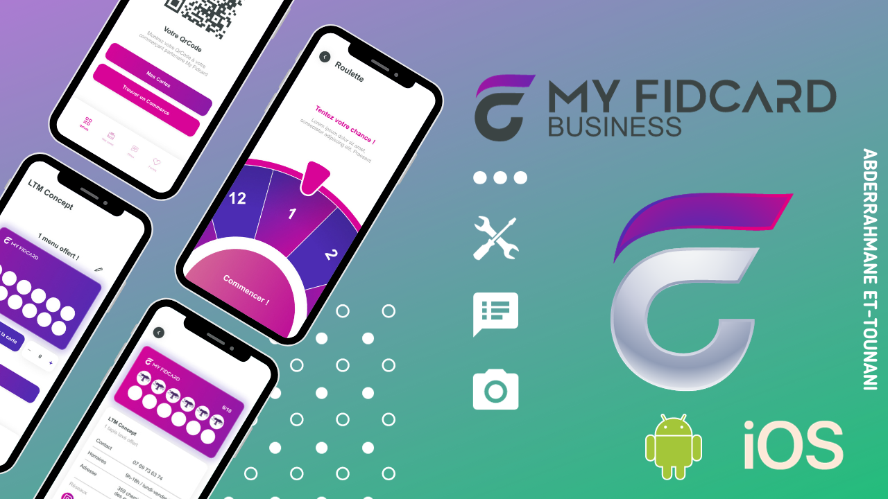
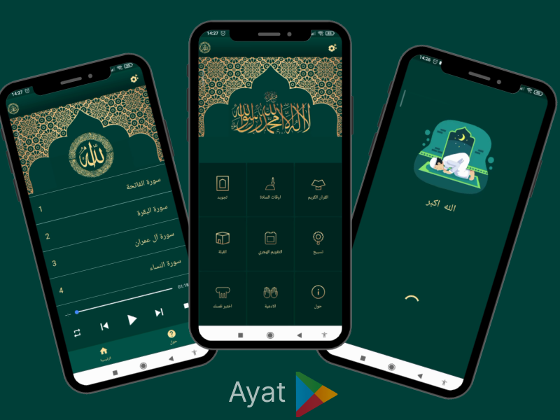
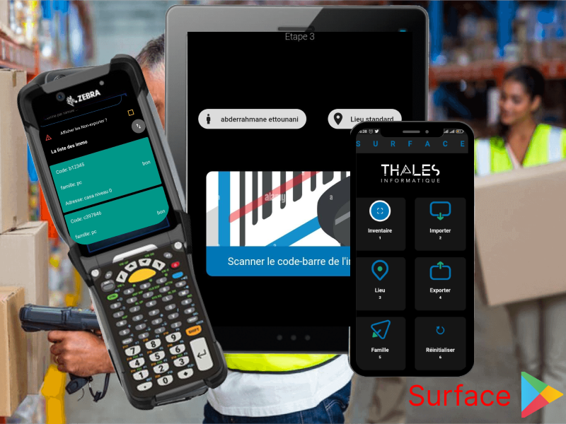
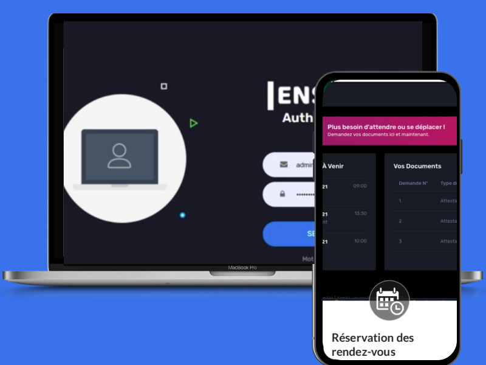

### <h1>Hey there   I'm Abderrahmane ET-TOUNANI </h1>

  <a href="https://www.linkedin.com/in/abderrahmane-et-tounani-21348020b/">
    
    
  
    

 
	

### <h2>:man_technologist: About Me :</h2>
 
- 📚 Currently employed as a Software Engineer at NimbleWays, I'm continually honing my skills and contributing to innovative projects. With a strong foundation in Computer Science and hands-on experience in Java, Spring boot, Next js, React Js and Flutter, I thrive in the dynamic world of software development.
- ⏰ In my free time, I like to experiment with new technologies and explore different software development methodologies.
- 📩 If you're interested in collaborating on a project or discussing the latest tech trends, feel free to reach out to me. I'm always up for a good conversation!
- :iphone:  connect with me:  

## Projects
  
<table>

  <tr>
    <td width="50%">
      <h3 align="center">My FidCard</h3>
      

        
        
        
      

    </td>
    <td width="50%">
      <h3 align="center">Discover Morocco</h3>
      

        
        
        
      

    </td>
  </tr>
  <tr>
        <td width="50%">
          <h3 align="center">Timetable generator</h3>
          

            
            
            
          

        </td>
        <td width="50%">
              <h3 align="center">TOP Jemla</h3>
              

                
        
        
                

        app available in <a href="https://play.google.com/store/apps/details?id=com.top.jemla" target="_blank" ref="noreferrer">Play Store</a>
                

              

            </td>
      </tr>
    <tr>
      <td width="50%">
          <h3 align="center">Azaf</h3>
          

             
		
		
            

		app available in <a href="https://play.google.com/store/apps/details?id=com.azaf.icoz" target="_blank" ref="noreferrer">Play Store</a>
            

          

        </td>
	<td width="50%">
          <h3 align="center">Ayat</h3>
          

            
		
		
            

		app available in <a href="https://play.google.com/store/apps/details?id=com.ettoun.ayat" target="_blank" ref="noreferrer">link</a>
            

          

        </td>
    </tr>
    <tr>
	<td width="50%">
          <h3 align="center">Surface</h3>
          

           
		  
		
            

		app available in <a href="https://play.google.com/store/apps/details?id=com.surface.surface" target="_blank" ref="noreferrer">link</a>
            

          

        </td>
	<td width="50%">
          <h3 align="center">Movie4U</h3>
          

           
		   
		
            

		app available in <a href="https://movies-ettounani.vercel.app/" target="_blank" ref="noreferrer">link</a>
            

          

        </td>
        </tr>
        <tr>
        <td width="50%">
          <h3 align="center">BTS</h3>
          

             
		
		
            

		app available in <a href="https://github.com/ET-TOUNANI/bts" target="_blank" ref="noreferrer">link</a>
            

          

        </td>
	<td width="50%">
          <h3 align="center">ENSET</h3>
          

            
		
		
            

		app available in <a href="https://github.com/ET-TOUNANI/scolaire" target="_blank" ref="noreferrer">link</a>
            

          

        </td>
    </tr>
</table>

 
 
<h3 align="left">Support:</h3>

  

 

	

